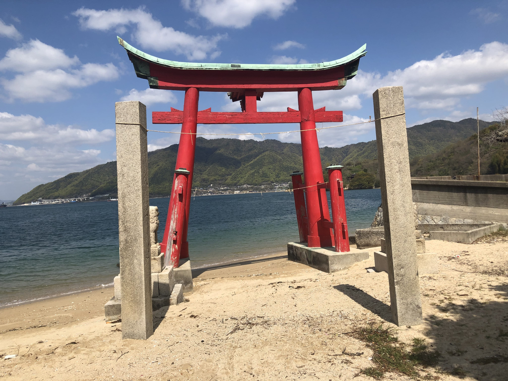
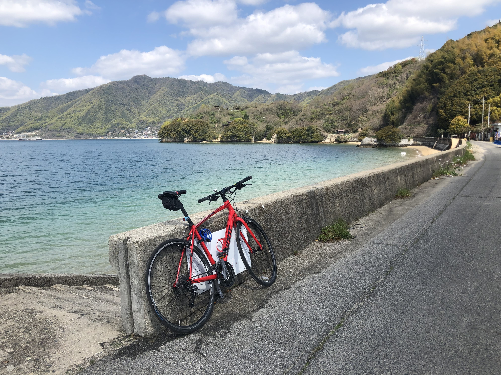
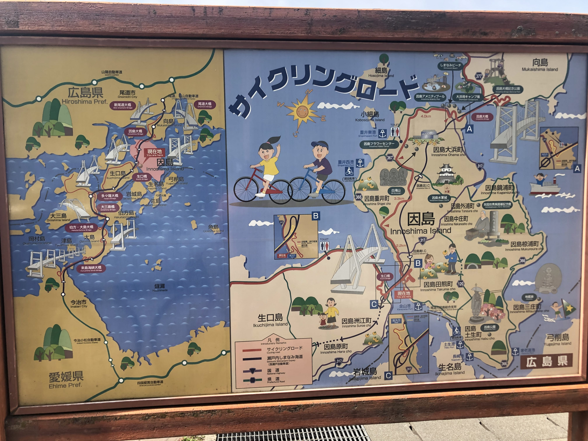
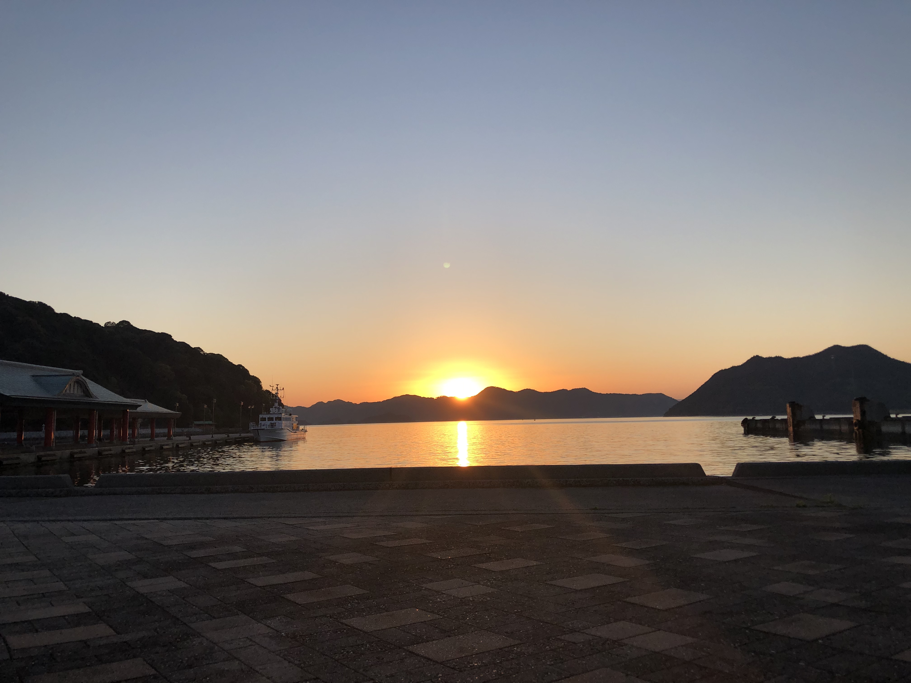

I started this post about a year ago but never got around to finishing it. Now that we're on the social isolation lifestyle here in Washington DC (and the world, generally), I've got some time.

The Shimanami Kaido was an absolute dream of a bike ride. It coupled all the things that make biking so great: smooth and empty roads, unbelievably views, well-marked paths, and awesome detours all over the place. The catch is that the route is in rural Japan and I don't speak Japanese. Luckily, the Japanese people I encountered were beyond friendly and helpful. Online information about the trail largely just says that it exists and that it's really great but there isn't much in terms of "how to" actually do it.

## Getting started

### 
A week before our trip, we called the [Giant store in Onomichi](https://bicyclerental.jp/en/area/hiroshima/8/) to reserve our bikes. They have all types of bikes at pretty reasonable rates. While there are more economy options available, I wanted to be able to feel the wind in my hair and taste the breeze. I figured the bikes from Giant would be in better shape that the others. This proved to be correct. Additionally, there's a Giant store on the other side of the sea in Imabari and I think you can return bikes there and ferry back to Onomichi if you want.

We also made a reservation at [Ohana Guesthouse](https://goo.gl/maps/naKTgB9bz6bvQxD49) which was fine for the night.

### Lodging

We booked an airbnb in Onomichi. I imagine that the closer to the train station and ferry you stay, the better off you'll be, but we don't mind walking so the idea of staying 20 minutes away from the train wasn't a big deal. We made the most of our experience by exploring [cat alley](https://en.japantravel.com/hiroshima/cat-alley-in-onomichi/33165) and having a walk through the [Hondori shopping street](https://www.tripadvisor.com/Attraction_Review-g651649-d9713900-Reviews-Hondori_Shopping_Street-Onomichi_Hiroshima_Prefecture_Chugoku.html). We got in later in the afternoon so thankfully didn't have a ton of time to kill. For dinner, we ate at a small ramen bar ([Ramen Matatabi](https://goo.gl/maps/jCKYP7AmgTqGQqL49)) that sat about 6 people. Onomichi has its own style of ramen that is characterized by a broth that's made with chunks of lard that float on top. From the [Michelin Guide](https://guide.michelin.com/us/en/washington/washington-dc/article/features/ramen-types-guide-origin):

> Four words: chunks of melted lard. That’s what you find bloating on top of the Onomichi ramen. Another distinctive feature of this style is the silky, flat homemade noodles as well as a hot shoyu broth. Similar to the Asahikawa ramen, the Onomichi ramen comes with a layer of hot oil. So just because your noodles don’t seem to be letting off any steam, it doesn’t mean it’s not warm enough to dive in. You have been warned.

### Luggage

There apparently are services that will transport luggage for you but we decided to just travel light with backpacks full of what we needed. The backpacks definitely were annoying but they were also easy and free to use. If I did the trip again, I'd probably do the same thing.

## Day 1

[Onomichi to Omishima](https://www.strava.com/activities/2291078100)

We decided to try to get to the Giant store when it opened so we could have a full day of riding ahead of us. We treated ourselves to breakfast at [U2](https://goo.gl/maps/FevwNGbSuRMjNZ9Z6) which connects to the Giant store. It was an all you can eat buffet so we fueled up on carbs and coffee before getting on our way. Getting our bikes from the Giant store was a breeze. I even managed to change my bike type the day of our adventure, switching from a road bike to a hybrid bike for more casual cruising. The Giant store is on a bike path that takes you to the ~5 minute ferry to Mukaishima. On that ferry ride, we met a man who told us he was on his way to work and that he was in charge of maintaining all the bridges across the islands. He asked where we were from and wished us well on our travels. As soon as we got to the other side, we were on the way!

### Mukaishima
We were so taken with excitement that we decided to immediately start adding bonus miles to our trip and took a loop around [Iwashi](https://goo.gl/maps/E6n2mwdaNZGaQGsH6) just to see what there was to see. We found a quiet little island with a farming community. I don't know what they were growing but it was quaint.

We rode back to Mukaishima and decided to climb and cross our first bridge onto Innoshima.

### Innoshima

There seemed to be two ways you could go on this island. The entire route has a blue line on the road denoting that it's part of the Shimanami Kaido so it's virtually impossible to get lost. Additionally, there were friendly maps all along the way. 

We decided to detour once again to add distance and see a castle. Why not? It turns out this castle had a small museum inside that we paid to visit. We learned a bit about Japanese pirates who seem to have been pretty good guys. They were less like the Pirates of the Caribbean and more so master sailors who knew the safest ways to navigate the dangerous currents and whirlpools of the seas as it snaked around the islands.

### Ikuchi

After exploring Innoshima a bit, we made it over to my favorite island. Ikuchi has the fabled [ice cream pit stop](http://www.setoda-dolce.com/) and I'm definitely not one to pass on that. After having ridden for several hours already, an ice cream break was just what we needed. This island was known for growing lemons or some other type of citrus and its character seemed to match. All along the way we were passed by cars with local politicians waving to us and [telling us (presumably) to vote for them for the betterment of Japan!](https://www.youtube.com/watch?v=-HImpJw7aqU). I imagine if I lived in Japan, this style of canvassing might get annoying but as a tourist, I absolutely loved it.

We rode along the northern perimeter of this island and just enjoyed the midday sun and views of the sea. There were only a handful of people out and about riding so the route was really peaceful.

### Omishima

Omishima was going to be our final island for the trip. As mentioned previously, we stayed in Ohana guesthouse since we had originally planned to ride the [Tobishima Kaido](http://www.cyclonoie.com/tobishimakaido-e.php) in addition to the Shimanami Kaido. After some soul searching and looking at maps and ferry schedules the night before we started our ride, we decided to just enjoy a more relaxed ride along the main route and save Tobishima for (hopefully) some day in the future.

We arrived on Omishima after riding and exploring for about 6 hours so we were pretty beat. We decided to take the shortest route to our hostel so we could nap, eat, then sleep again. After getting situated in our hostel, we both took quick naps just to stretch and get a little refreshed. Afterwards, we walked down to the edge of the water, bought some Sapporo, and sat and watched the sun set. Time for dinner.

We hadn't really done any research here and options were super limited. As it was a Monday and we were in a small town, almost nothing was open. I'm not much of a seafood eater (dangerous in Japan, I know) but I had resolved myself to the idea that I might be eating something a bit more raw than what I'm used to. 

We were lucky enough to find a restaurant that was not only open but had an English(-ish) menu. They were happy to accommodate us and we had a really nice dinner. Walking back to the hotel afterward, we decided to wander through the town. It was a little spooky since there was no one around and it was so dark that we had to use our phone flashlights at times. Out of nowhere though, we stumbled upon a [craft brewery](https://ja-jp.facebook.com/omishimabrewery/) that happened to be open. Of course we couldn't pass this up so we went in and grabbed a beer. The only other 2 people in the space happened to be a father and his daughter from USA so we had friends to talk to about the ride so far, where they came from, and what they were doing. The daughter spoke some Japanese and was able to impress the staff and better express our gratitude.

Note: Apparently there's also [a winery](http://ohmishimawine.com/) just down the street!

## Day 2

[Omishima to Onomichi](https://www.strava.com/activities/2293140950)

We woke up and decided against trying to finish the whole ride to Imabari. There was plenty to enjoy along the ride back to Onomichi. Upon getting out to our bikes, however, we realized the importance of bike shorts. We were both in so much pain from the previous day's ride that it was impossible to simply sit on the seat and I had to ride standing up for a while.

We covered roughly the same route heading back but with a detour that took us through a more bustling town. We grabbed breakfast at a supermarket and made another friend; an old man who spoke a little bit of English introduced himself, asked where we were from, and told us we now had a Japanese friend-o. My heart was full.

I had wanted to detour to [a hike where there are hundreds of buddha statues on the top of a mountain](http://www.asahi.com/ajw/articles/AJ201911260008.html) but the whole "top of a mountain" thing while I was riding a bike wasn't really going to happen.

We made it back to Onomichi just after noon. To refuel a bit, we went to get some tacos at a Mexican restaurant owned by a Japanese woman who had lived in Oaxaca. We were able to speak a bit in Spanish about her time living in Oaxaca and me visiting there. My mind was blown to see Mexican hot sauce in Onomichi.

After tacos, we trekked up the mountain (ok, took the cable car) to enjoy the views then walked down again through cat alley. We returned the bikes to Giant and caught the train outta there back to Hiroshima. What an adventure.

## Bonus considerations

### Do you have a rain plan?
We didn't. The day we arrived in Onomichi, it was raining a good bit. If that had kept up, our trip would have been ruined. We got lucky that our riding days were glorious.

### Ferry schedules
A printed out ferry schedule would have been really helpful. Since the route was so well marked, we found ourselves constantly wanting to explore things like castles, giant dinosaur statues, parks, the epic vistas that were at the top of each bridge, and the fried chicken selection at [Lawson's](https://www.eater.com/2017/2/21/14668440/tokyo-convenience-store-conbini-snacks#b0BkRi). While out on the Shimanami Kaido, I didn't feel confident that I'd be able to just hop into a hotel if we got stuck somewhere since there weren't really hotels as far as I could tell so we were constantly checking our watches and guessing at how long it would take us to ride from point to point.

### Additional resources

The sites I found most useful were:
- https://shimanami-cycle.or.jp/go-shimanami/
- http://www.oideya.gr.jp/shimanami_cycling/english/contents/around30/tobishima/page1.html