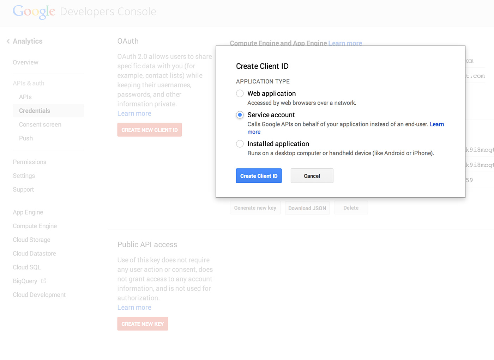
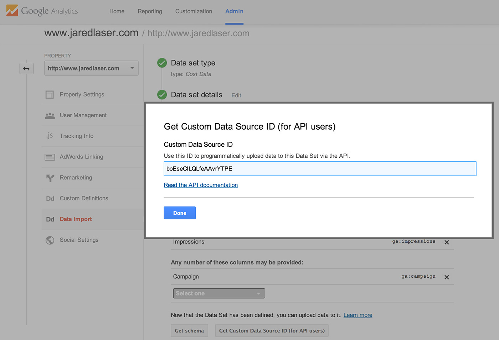

In the world of ads, apparently it's good to not just run ads but also see how effective they are. Who woulda thought? Google's ad platform is obviously a big one but they're certainly not the only one. In this case, we're getting data from Facebook's ad system, putting it into a CSV, and then uploading it to Google Analytics (GA) so we can run queries against it (or something. See disclaimer).

I started [here](https://developers.google.com/analytics/devguides/platform/cost-data-import) and it really wasn't the most helpful page. Hopefully this walkthrough alleviates some of the pains I had.

To get started, you'll want to know what kind of data you want to import. You **must have** `ga:medium` (ex: "organic", "email", etc.) and `ga:source` (ex. "facebook")

Aside from those two, you have to have at least one of the following:

- `ga:adClicks`
- `ga:adCost`
- `ga:impressions`

Otherwise, what are you even tracking?

So think about your data in these terms, you can export it now from your data source, or you can do it later. The world is yours.

## API access

You'll need an account that can access the GA API. Google has approximately a billion different APIs so hit up their Developer Console. Create a new project then select it to create users within it. I called my project "Analytics". You can get similarly creative if you want. We're going to hang out in the APIs & auth section. Go to the item called Analytics API and turn it on. Easy.

Since we're working on the server, we'll want to create a new Client ID and make sure it's a service application. Once you create that, a .p12 file will download to your machine. Don't close this tab.



Google gives you a .p12 file but when authenticating, you need a .pem file. If you're on a Mac, you can use the handy openssl tool on the command line to create a .pem. `$ cd` into your Downloads directory and run this:

`openssl pkcs12 -in downloaded-file.p12 -out key.pem -nodes`

I moved the pem to the project directory just so it'd be easier to access later.

Take a quick look at the "Permissions" section and make sure that this new user you created has the "Can Edit" permissions.

## setup GA

Firstly, and this really frustrated me for a few hours, use email that you got from creating a Client ID and add it as a user the the GA profile you're going to be uploading data to.

Let's go ahead and get GA setup. Login to your GA profile an use the Admin tab on top. Pick the property you want to upload data to then use the Data Import section to create a new data set for Cost Data. Give it a name, select your views, and then setup your schema. Grab the Custom Data Source ID because you'll need it later. Save it and let's move on.



## javascript

Google has a [handy Node lib](https://github.com/google/google-api-nodejs-client/) that makes connecting to their APIs a bit easier. I'm going to cross my fingers that you understand a bit of nodejs so just get the file started with your requires

```javascript{numberLines: true}
var googleapis = require('googleapis');
var fs = require('fs');
```

Google uses a JSON Web Token to connect to their APIs. You don't have to make it yourself, exactly, you just have to pass parameters to it. Creating the auth client is kind of easy assuming you blindly follow examples and don't try to read any docs. Here's what I ended up with and it worked:

```javascript
// auth details
var email = 'EMAIL_ADDRESS_HERE'; // (str) the email address provided when you create an API user
var keyPath = './key.pem';        // (str) check out step 6 here: https://github.com/extrabacon/google-oauth-jwt#creating-a-service-account-using-the-google-developers-console
var key = '';                     // (str) not sure, apparently you don't need it if you pass a working .pem keyfile

// Construct the JWT client
var authClient = new googleapis.auth.JWT(email, keyPath, key, ['https://www.googleapis.com/auth/analytics']);
```

The googleapi module make the whole process fairly easy, my biggest difficulty was finding what I had to pass to the upload function before it would actually upload.

The [docs for dailyUploads](https://developers.google.com/analytics/devguides/config/mgmt/v3/mgmtReference/management/dailyUploads/upload#request) are fairly helpful but didn't do the best job describing what options were. Luckily, I figured them so you don't have to.

```javascript
var opts = {
    accountId: 'ACCOUNT_ID',              // (str) in 'UA-5345434-1', the accountId is 5345434
    appendNumber: 1,                      // (int) 1-20. if you're just adding one CSV, this will be 1, if you append another, increment this
    customDataSourceId: 'DATA_SOURCE_ID', // (str) the customDataSourceID you got when you created the client ID
    date: 'YYYY-MM-DD',                   // (str) the date that the data represents. 
    uploadType: 'media',                  // (str) probably just stick with media if you're uploading a simple CSV
    type: 'cost',                         // (str) sweet option, Google. The only acceptable value here is 'cost' so leave as-is
    webPropertyId: 'WEB_PROPERTY_ID'      // (str) this is the GA id for the profile. Something like 'UA-5345434-1'
};
```

Real quick, we want to get a string representation of the CSV so go ahead and get that using node's fs module.

```javascript
var pathToCSV = './data/data.csv';
var csvData = fs.readFileSync(pathToCSV, "utf8");
```

So now we can create the client, kick some options to it, authorize and upload our data. Make sure this is wrapped in an `authClient.authorize()` so we're producing an access token.

```javascript
client
    .analytics.management.dailyUploads.upload( opts )
    .withMedia( 'application/octet-stream', csvData )
    .withAuthClient( authClient )
    .execute(function( err, results ){
        if ( err ) {
            console.log( err );
            return;
        } else {
            console.log( results );
        }
    });
```

If you've done everything right, you should be able to run `$ node app.js` and get a response that contains a nextAppendLink.

All together now!

```javascript
var googleapis = require('googleapis');
var fs = require('fs');

// auth details
var email = 'EMAIL_ADDRESS_HERE'; // (str) the email address provided when you create an API user
var keyPath = './key.pem';        // (str) check out step 6 here: https://github.com/extrabacon/google-oauth-jwt#creating-a-service-account-using-the-google-developers-console
var key = '';                     // (str) not sure, apparently not needed if you pass a working .pem keyfile

// Construct the JWT client
var authClient = new googleapis.auth.JWT(email, keyPath, key, ['https://www.googleapis.com/auth/analytics']);

// Authorize it to produce an access token
authClient.authorize(function(err, tokens) {
    if (err) {
        console.log( err );
    }
    googleapis
        .discover('analytics', 'v3')
        .execute(function(err, client) {

            // data
            var pathToCSV = './data/data.csv';
            var csvData = fs.readFileSync(pathToCSV, "utf8");

            // GA Options
            var accountId = 'ACCOUNT_ID_HERE';            // (str) in 'UA-5345434-1', the accountId is 5345434
            var formattedDate = 'YYYY-MM-DD'              // (str) date for data
            var customSourceId = 'CUSTOM_DATA_SOURCE_ID'; // (str) in GA admin control panel, get this from data import=>manage a data set
            var webId = 'WEB_PROFILE_ID';                 // (str) id from google analytics for the profile

            var opts = {
                accountId: accountId,
                appendNumber: 1,
                customDataSourceId: customSourceId,
                date: formattedDate,
                reset: true,
                uploadType: 'media',
                type: 'cost',
                webPropertyId: webId
            };

            client
                .analytics.management.dailyUploads.upload( opts )
                .withMedia( 'application/octet-stream', csvData )
                .withAuthClient( authClient )
                .execute(function( err, results ){
                    if ( err ) {
                        console.log( err );
                        return;
                    } else {
                        console.log( results );
                    }
                });
        });
});
```
SO there you go, you can upload cost data to GA. Now you can query it just like anything else in GA.